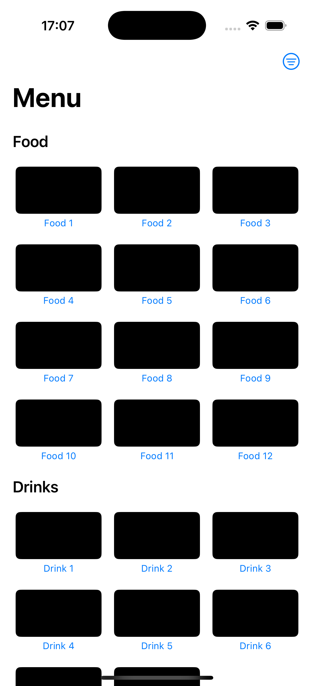
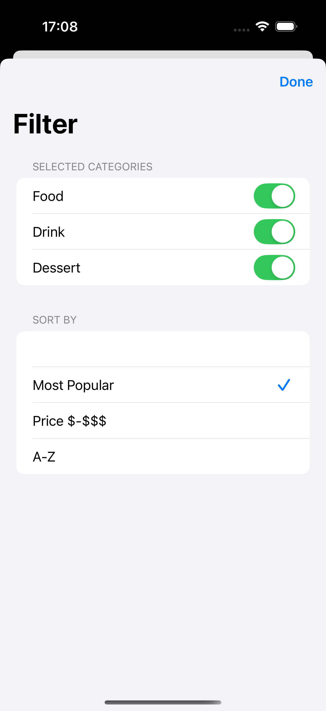
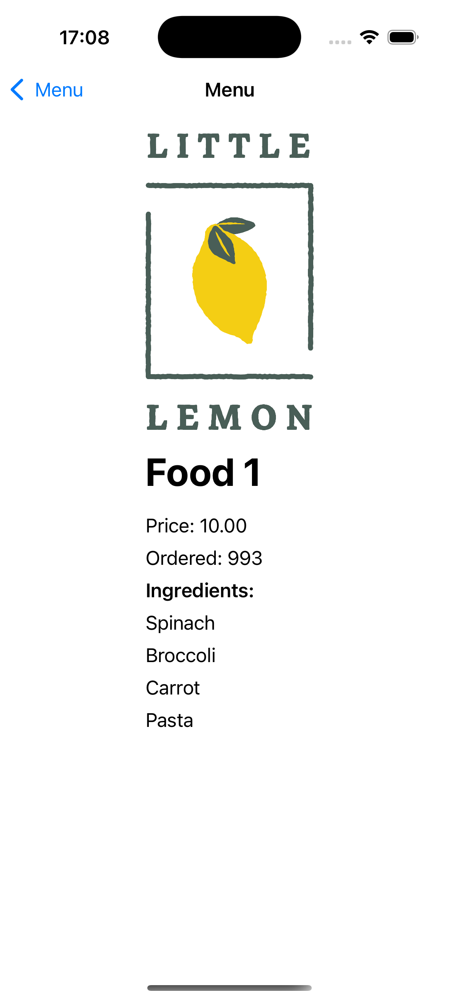

# LittleLemonMenu (SwiftUI)

iOS app built during **Meta iOS — Advanced Programming in Swift**.  
Focus on modern SwiftUI patterns, clean architecture, error handling, media, and tests.

## What it does
- Multiple SwiftUI screens using `NavigationStack`
- **State management** with `@State`, `@ObservedObject`, and `@EnvironmentObject`
- **MVVM** with protocol‑driven dependency injection
- **Error handling** via `throws` / `do–try–catch`
- Uses higher‑order functions (`map`, `filter`, `reduce`) where it makes sense
- **Unit tests** with XCTest (and optional UI tests)
- Basic **accessibility** (labels, Dynamic Type–friendly layout)

## Requirements
- Xcode 15+ · iOS 17+
- Swift 5.9+
- Swift Package Manager (SPM)

## Getting Started
1. **Clone**
   ```bash
   git clone https://github.com/<your-user>/LittleLemonMenu.git
   cd LittleLemonMenu
   ```
2. **Open & Run**
   - Open `LittleLemonMenu.xcodeproj` (or `.xcworkspace` if you use Pods)
   - Select an iPhone Simulator → **Run** (⌘R)

## Screenshots
<p>
  
  
  
</p>


## Notes
- If Xcode Previews warn about **Development Assets**:
  - Leave **Build Settings → Development Assets** empty **or**
  - Create a **folder reference (blue)** named `Preview Content` with `Preview Assets.xcassets` inside.
- Keep a small mock API or local JSON for offline builds/tests if the app fetches data.

## Run Tests (optional)
```bash
xcodebuild -scheme "LittleLemonMenu"   -destination 'platform=iOS Simulator,name=iPhone 15'   test
```

## License
This project uses the **MIT License**. See `LICENSE`.
